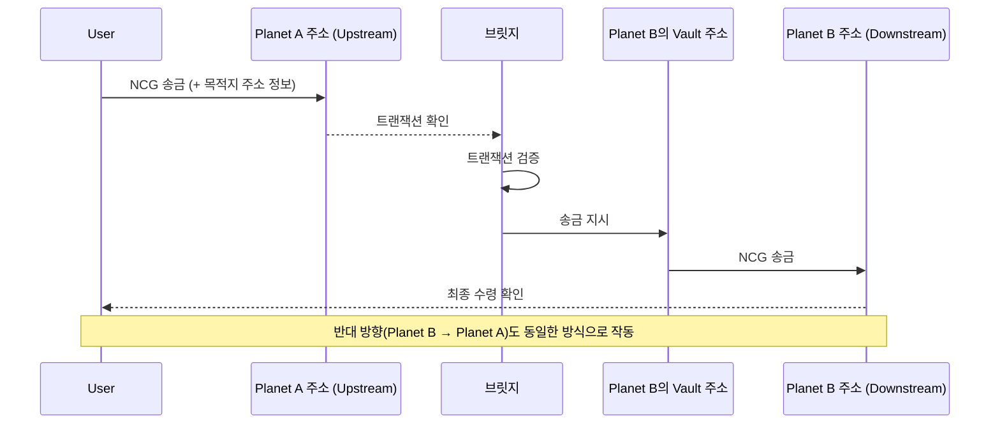

# NineChronicles Bridge

나인크로니클의 서로 다른, 즉 Planet A와 Planet B 간 NCG 송금을 위한 브릿지입니다.

## 개요

이 프로젝트는 서로 다른 Planet 간 NCG 토큰을 전송하기 위한 브릿지 역할을 합니다. 기본적인 구조는 다음과 같습니다.

## 구현

- **트랜잭션 모니터링**: Headless GraphQL 클라이언트를 통해 각 Planet의 트랜잭션을 실시간으로 모니터링합니다.
- **상태 저장**: PostgreSQL 데이터베이스를 사용하여 각 트랜잭션의 처리 상태와 진행 상황을 추적합니다.
- **토큰 송금**: 브릿지는 사용자가 지정한 목적지 주소로 직접 서명하여 NCG를 송금합니다.

## 시작하기

프로젝트 설정 및 실행 방법에 대한 자세한 내용은 [CONTRIBUTING.md](CONTRIBUTING.md) 파일을 참조하세요.
