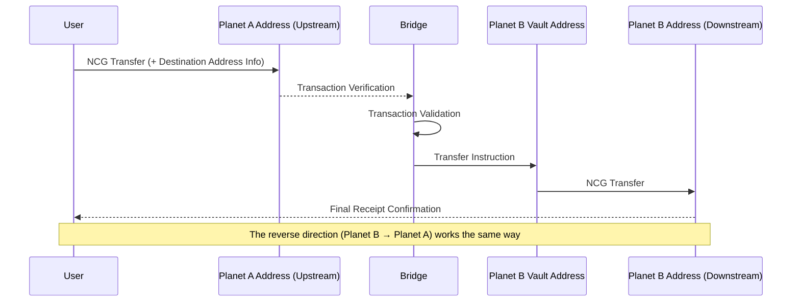

# NineChronicles Bridge

A bridge for transferring NCG between different planets (Planet A and Planet B) in Nine Chronicles.

## Overview

This project acts as a bridge for transferring NCG tokens between different planets. The basic structure is as follows:

## Implementation

- **Transaction Monitoring**: Real-time monitoring of transactions on each planet through Headless GraphQL client.
- **State Storage**: Using PostgreSQL database to track the processing status and progress of each transaction.
- **Token Transfer**: The bridge directly signs and sends NCG to the destination address specified by the user.

## Getting Started

For detailed information on project setup and execution, please refer to the [CONTRIBUTING.md](CONTRIBUTING.md) file.
